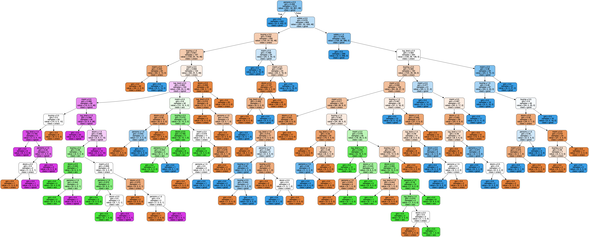
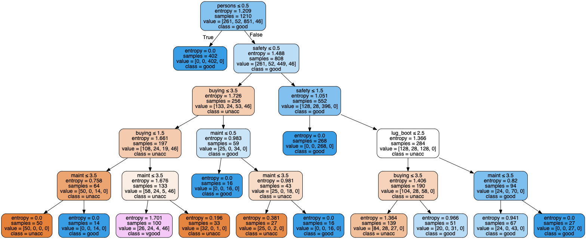

# Decision Tree Car Evaluation Dataset

## Purpose

To understand how to construct decision tree from dataset for classification in machine learning. Using [Car Evaluation](https://archive.ics.uci.edu/ml/datasets/Car+Evaluation) data set from UCI. Although it old but it really decent to use for learning and practicing in data science.
I have already modified data and saved it in [car.xlsx](car.xlsx) file, so that it can be read as excel using pandas library.

## Requires

- [Python3](https://www.python.org/downloads/)

- [Jupyter Notebook](https://jupyter.org/)

## Implement

Apply Bagging clssification and Random Forest classification to construct Desicion Tree to compare which is better in accurancy percentage, and plot data on graph.

While playing around with library I figured how to make dicision tree visualization, it very beautiful. :)

Decision tree build from dataset using entropy as criterion.

Decision tree cut down to max 5 depth

